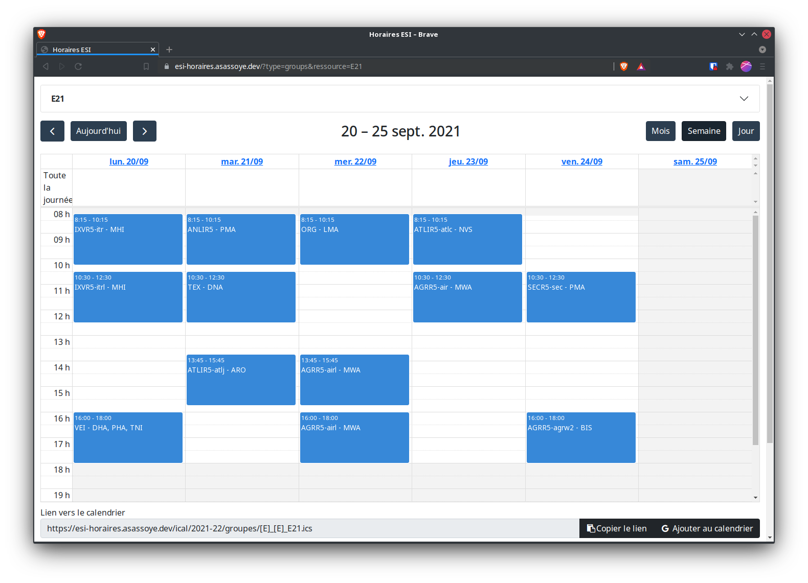

# Display timetable

Use [FullCalendar][1] to display students and teachers timetables[^1].



# Live app

Timetables can be seen at https://horaires.esi-bru.be

# Compile and serve

## From docker

If you have Docker, just run
```bash
make
```
and connect to <https://localhost:8080>

## From the local machine

You need node and yarn. To install all the dependencies:

```bash
$ yarn
```

You also need iCalendar files and a config file (detailled explanation can be found below). The easiest is to grab those from our live app, e.g. :

```sh
wget -O- https://github.com/HEB-ESI/heb-esi.github.io/archive/refs/heads/gh-pages.tar.gz |
 tar -zx --strip-components=1 heb-esi.github.io-gh-pages/ical heb-esi.github.io-gh-pages/config
```

To compile (the compiled files will be generated in the `./dist` directory)

```bash
$ yarn build # Production
$ yarn dev # Development
$ yarn watch # Dev + watch for changes
```

Alternatively, you can serve locally :

```bash
$ yarn serve
```

Pull requests and issues are welcome. 
Before commit, please verify if you respect the linting by executing the command `yarn lint`.

# Internals

Comme mentionné plus haute, nous utilisons [FullCalendar][1] pour afficher des
événements dans un beau calendrier dans le navigateur.

Les événements sont obtenus via des fichiers iCalendar (.ics) généralement
rangés dans une arborescence du type :

```
ical/2021-2022/q2
├── cours
│   ├── AGLR4.ics
│   ├── ...
│   └── WIRR4-rsml.ics
├── groupes
│   ├── B111.ics
│   ├── ...
│   └── SEC4B.ics
├── profs
│   ├── ABS_ABSIL_Romain.ics
│   ├── ...
│   └── YVO_VOGLAIRE_Yannick.ics
└── salles
    ├── 003.ics
    ├── ...
    └── 604.ics
```

Afin de ne pas coder en dur les noms des fichiers iCalendar utilisés, nous les
récupérons (via AJAX) grâce à un fichier de configuration.

Le nom du fichier de configuration (par défaut `calendars.json`) est
intégré en dur au moment de compiler le projet (voir fichier
`./src/utils/configUrl.json` -- le contenu de ce fichier est typiquement ajusté
par le processus de déploiement ; voir `.github/workflows/main.yml` pour un
exemple).

Les fichiers iCalendar sont générés par la personne en charge des horaires via
son logiciel Hyperplanning. Le fichier de configuration est généré
automatiquement à partir de là. Ceci permet de découpler les mises à jour du
code de celles des fichiers iCalendar.

## Fonctionnement du fichier de configuration

Le fichier de configuration `calendars.json` ressemble a ceci:

```json
{
    "default": "groupes",
    "root": "ical/2021-2022/q2",
    "data": {
        "cours": {
            "key": "cours",
            "name": "Cours",
            "items": {
                "ALG3": {
                    "key": "ALG3",
                    "name": "ALG3",
                    "calendar": "cours/ALG3.ics"
                }
            }
        },
        "groupes": {
            "key": "groupes",
            "name": "Groupes",
            "items": {
                "E21": {
                    "key": "E21",
                    "name": "E21",
                    "calendar": "groupes/E21.ics"
                }
            }
        },
        "profs": {
            "key": "profs",
            "name": "Profs",
            "items": {
                "ABS": {
                    "key": "ABS",
                    "name": "Romain Absil",
                    "calendar": "profs/ABS_ABSIL_Romain.ics"
                }
            }
        },
        "salles": {
            "key": "salles",
            "name": "Salles",
            "items": {
                "004": {
                    "key": "004",
                    "name": "004",
                    "calendar": "salles/004.ics"
                }
            }
        }
    }
}
```

Veuillez respecter les points suivants si vous voulez survivre :

- Les elements `key` doivent impérativement être uniques dans tout le fichier
- Les elements `key` doivent uniquement contenir des caractères de type `A-Z`, `a-z` ou `-`
- Les liens `calendar` sont un lien relatif vers les icals
- La case `name` est affiché à l'écran, le `key` est utilisé par _react_ et pour les liens

Un tel fichier peut être généré à partir des icals. Depuis la racine du dépôt:
1. placer les iCal dans `/{groupes,cours,profs,salles}`
2. placer le fichier `/config/personnel.json` depuis https://github.com/HEB-ESI/he2besi-web/raw/master/jekyllsrc/_data/personnels.json
3. Generer le fichier avec l'une des deux commandes ci-dessous

```bash
$ yarn generate:config ical/2021-2022/q2/
$ npm run generate:config -- ical/2021-2022/q2/
```

Le fichier de configuration des calendriers est fetch au chargement de la page à l'adresse `protocol://domain-name.be:port/config/calendars.json`
Si le fichier est mal formé ou non présent, cela fait planter le site. Et c'est entièrement votre faute! 😈

Have fun!


# Contributors

- Pierre Bettens *pbt*
- Nicolas Richard *nri*
- Frédéric Servais *srv*
- Andrew Sassoye

*v1 « À l'arrache » par Pierre, Nicolas (Némo) et Frédéric (Sébastien)*  
*v2 « Marie revisitée » par Andrews*  
*v2.1 « Peu me chaut » par Nicolas (Némo)*  

[^1]: We used to use [Leonaard project][0] (dead link) together with [ical.js][2] to convert iCalendar (ics) to JSON.
Nowadays FullCalendar fully supports ics as a [Event Source][3] (still using ical.js).

[0]: https://github.com/leonaard/icalendar2fullcalendar

[1]: http://fullcalendar.io/

[2]: https://mozilla-comm.github.io/ical.js/

[3]: https://fullcalendar.io/docs/icalendar

[4]: https://downgit.github.io/#/home?url=https://github.com/HEB-ESI/heb-esi.github.io/tree/gh-pages/ical

[5]: https://github.com/HEB-ESI/heb-esi.github.io/tree/gh-pages/ical  
